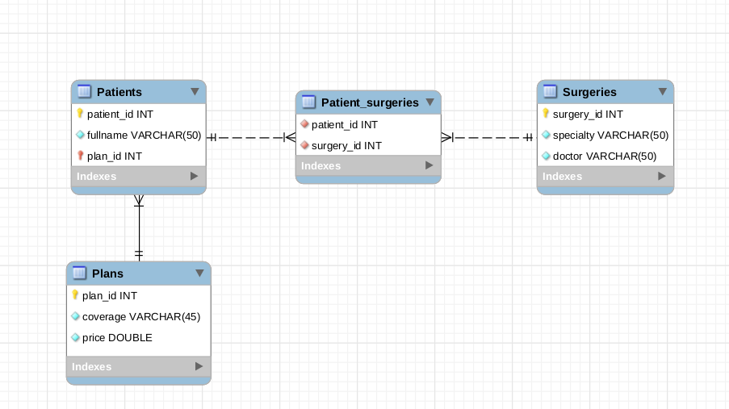

Esse é um projeto para o conteúdo de `ORM - Associations`
### Antes de iniciar

Crie um fork desse projeto e para isso siga esse [tutorial de como realizar um fork](https://guides.github.com/activities/forking/).

Após feito o fork, clone o repositório criado para o seu computador.

Rode o `npm install`.

Vá para a branch master do seu projeto e execute o comando:

git branch

Mude para a branch sequelize-associations com o comando git checkout -b sequelize-associations. É nessa branch que você realizará a solução para o exercício.

Observe o que deve ser feito nas instruções.

Após a solução dos exercícios, abra um PR no seu repositório forkado e, se quiser, mergeie para a master, sinta-se a vontade!

**Atenção!** Quando for criar o PR você irá se deparar com essa tela:

É necessário realizar uma mudança. Clique no *base repository* como na imagem abaixo:

Mude para o seu repositório. Seu nome estará na frente do nome dele, por exemplo: `antonio/exercise-sequelize-associations`. Depois desse passo a página deve ficar assim:

Agora basta criar o PULL REQUEST clicando no botão `Create Pull Request`.

Para cada PR realize esse processo.

### COMEÇANDO OS EXERCÍCIOS

Nesse exercício vamos criar uma API que será responsável pela gestão de um sistema de saúde. Nesse sistema terão pacientes, cada um com seu plano. Cada paciente pode ter realizado várias cirurgias, que por sua vez, devem ser listadas e categorizadas. O diagrama abaixo demonstra como o banco de dados se comportará:

Este repositório ja contém alguns arquivos padrões, ao executar `npm install` as seguintes dependências foram instaladas:

- express

- nodemon

- sequelize mysql2

- sequelize-cli

Será necessário configurar o arquivo `config/config.json` com os dados de seu servidor.

Após, utilize os comandos:

- `npx sequelize db:create`
- `npx sequelize db:migrate`
- `npx sequelize db:seed:all`

Esses comandos vão criar respectivamente, a `database`, as `tables` e após, inserir dados exemplos nas tabelas.

As tabelas criadas são:

- Patients
- Patients_surgeries
- Plans
- Surgeries

Feito isso, ja podem ser realizados os exercícios abaixo.

#### Exercício 1

Crie o model de `Plans`.

#### Exercício 2

Crie o model de `Patients`.

#### Exercício 3

Crie o model de `Surgeries`.

#### Exercício 4

Crie o model de `Patient_surgeries`.

#### Exercício 5

Crie um endpoint que liste todos os pacientes e seus respectivos planos.

#### Exercício 6

Crie um endpoint que liste todos os pacientes e suas respectivas cirurgias realizadas.

#### Exercício 7

Crie um endpoint que de acordo com o id de um plano, que deve ser recebido via requisição, liste os pacientes que o possuem.

### Bônus

#### Exercício 1 

Crie um endpoint capaz de adicionar um novo paciente.

#### Exercício 2

Crie um endpoint que liste todos os pacientes e suas cirurgias realizadas, mas oculte o nome do médico responsável.

#### Exercício 3

Crie um endpoint que de acordo com o nome do médico, que deve ser recebido via requisição, liste todas as cirurgias realizadas pelo mesmo, um get na url `http://localhost:3000/surgeries/Rey%20Dos%20Santos`deve retornar as cirurgias realizadas pelo médico `Rey Dos Santos`.